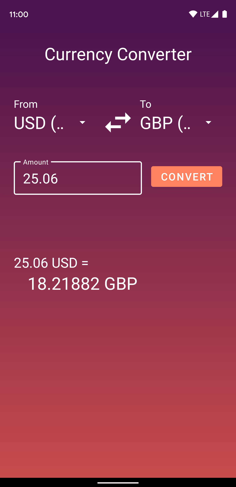

# Android Currency Converter

## Overview
Converts a value from one currency to another based on the exchange rates from [The Free Currency Converter API](https://free.currencyconverterapi.com/). All the possible currencies and their corresponding symbols are loaded upon app startup. Once the user selects the base and target currencies, a request is sent asking for the desired conversion rate. The response from the API also contains the conversion rate for the opposite conversion as well since there's a high chance that the user will want to convert back forth. Each rate is cached locally in order to cut down on the number of API call made and to help speed up the calculation.  

  

# Components Used
* **MVVM Architecture**
* **Retrofit**
* **Kotlin Coroutines**
* **Object Animators**