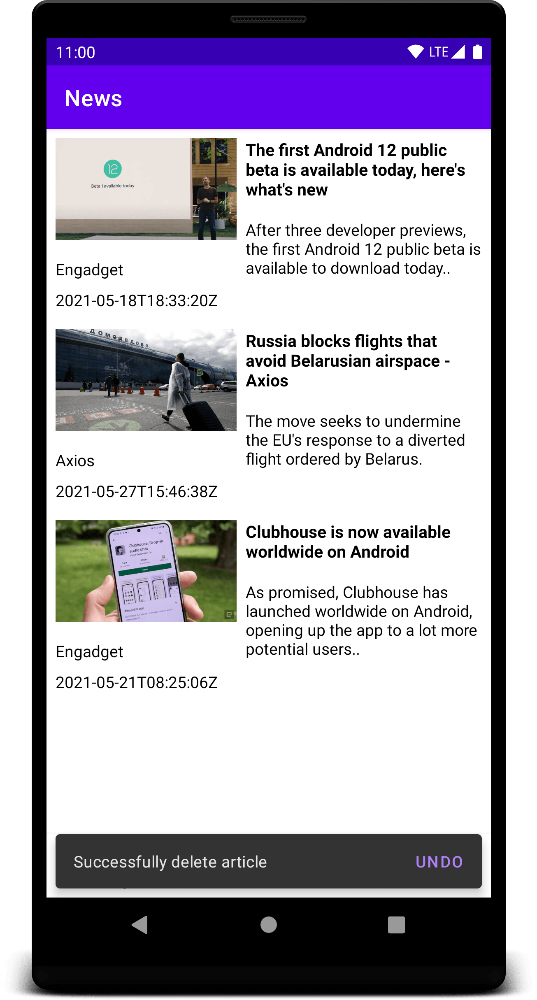

# Android News

## Overview
Android app that shows news articles from over 75,000 news sources using the [newsapi.org](https://newsapi.org/) API. Articles can be searched by keyword and favorites can be saved for later. Loading articles is accomplished with pagination, where more articles are loaded when the user scrolls to the bottom of a screen. Individual articles can be clicked on to open the full article.

## Breaking News

This screen displays popular current articles. Sscrolling to the bottom of the page will load more articles.

 

## Search News

This screen shows articles based on a user provided search query. The list of articles is refreshed when the text of the search query is changed; a request will only be sent once the text hasn't changed for 500ms in order to give the user a chance to input the entire query string without making intermediate requests.

 

# View a Full Article

To see a full article just click on it in either the Breaking or Search News screen. Use the floating action button to save the article.

 

# Saved News

This screen shows a list of saved articles, which are stored locally. Swipe left or right on an article to delete it. There is an undo feature if an article is delete accidentally.

 
 

### Components Used
* **Retrofit**
* **Glide**
* **Room**
* **Hilt**
* **Data Binding**
* **View Binding**
* **Kotlin Coroutines**