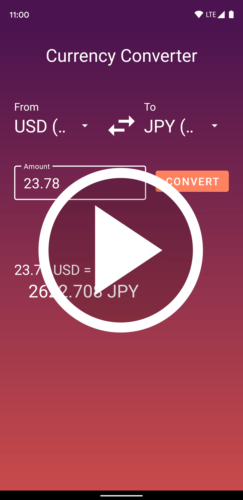
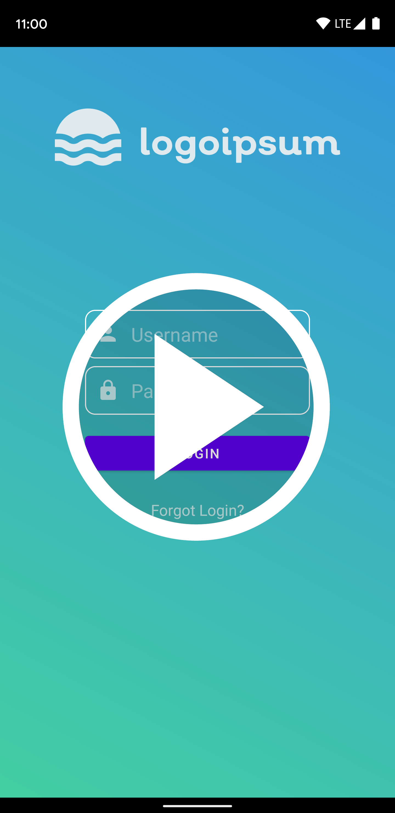
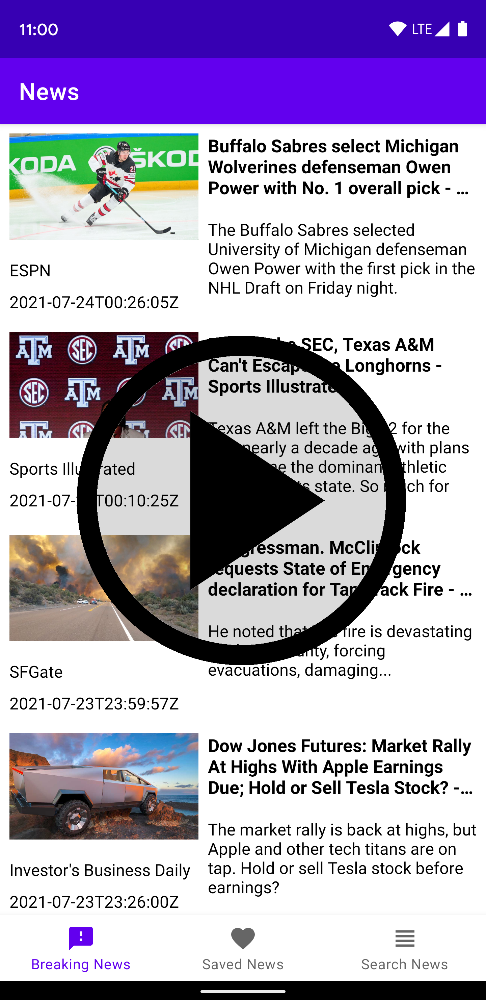
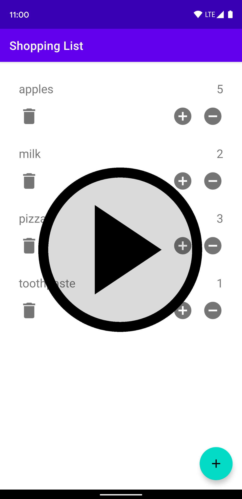

# Small Android Apps
A collection of apps that I've made in order to learn various tools and techniques for Android development (e.g. dependency injection, Android Architecture components, various ways of organizing project structure, etc.). Each project folder contains a more detailed description of the app and a summary of the components used to build it.

## Currency Converter
Convert any of a wide range of currency types to any other using a remote API.
<a href="https://youtu.be/KWG5Eh4AOYQ">  
    
</a>

## Login
Log in screen with an animated gradient background, and transistion animations when correct credentials are entered.  

## News
Displays a list of news articles using the [newsapi.org](https://newsapi.org/).  

## Shopping List
Holds a list of shopping items and the amount to buy.  
