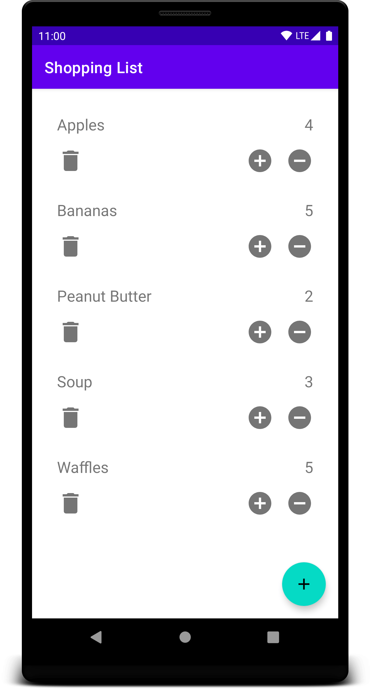
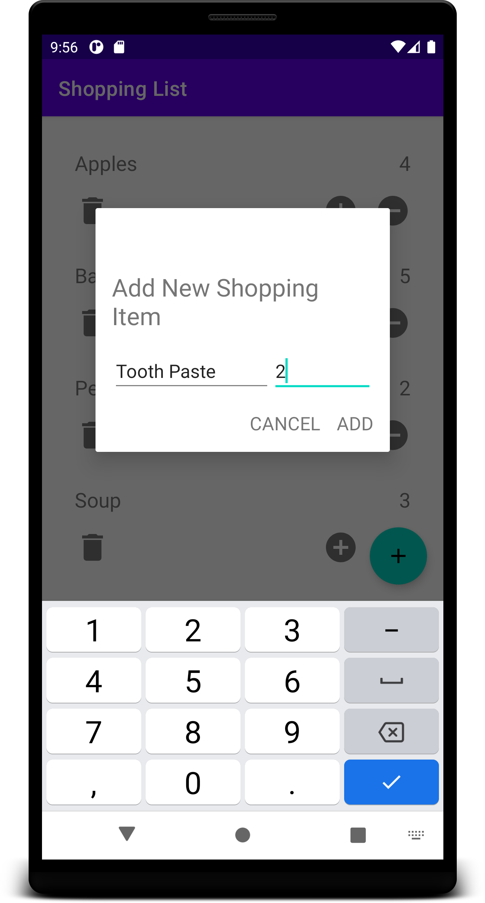
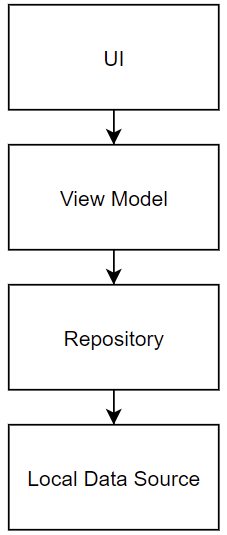

# Android Shopping List

## Overview
This app helps a user create a shopping list, which contains inidivdual items along with an amount of each. The amount of any item can be increased/decreased via the plus/minus buttons, or an item can be removed from the list via the trash button.
 
 
It's built using the MVVM architecture, based on the recommended Android guidelines: 

 
 
### Components Used
* **Room**
* **Hilt**
* **Data Binding**
* **View Binding**
* **RecyclerView**: displays the shopping items using Data Binding in the View Holders.